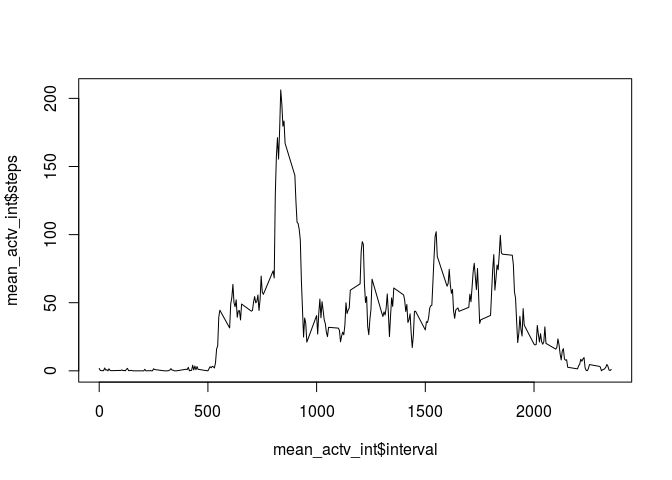

Assignment 1
============

### Steps per day (mean & median)
After reading the file, we aggregate the step data by date. Since *aggregate* by default leaves NA values out, we leave it like that. 
We plot a histogram of steps per day. Then we calculate mean and median.


```r
actv <- read.csv("./activity.csv")
sum_actv_day = aggregate(steps ~ date, data = actv, sum)
hist(sum_actv_day$steps)
```

 

```r
mean(sum_actv_day$steps)
```

```
## [1] 10766.19
```

```r
median(sum_actv_day$steps)
```

```
## [1] 10765
```

### Average daily activity pattern
In this part we aggregate the steps by interval to find average number of steps per interval across all days. 


```r
mean_actv_int = aggregate(steps ~ interval, data = actv, mean)
# Plot of steps per interval for all intervals :
plot(mean_actv_int$interval, mean_actv_int$steps, type = "l")
```

 

```r
# The interval with max steps in average :
mean_actv_int[mean_actv_int$steps == max(mean_actv_int$steps), 1]
```

```
## [1] 835
```

### Imputing missing values
First we calculate total number of NAs for step column. To impute missing data we will replace NA values for each interval by the average for that interval across all days. To do this we first subset the activity data frame to only choose intervals and steps columns. Then we combine this new data frame with the averaged data frame (*mean_actv_int*) so we can easily replace missing values in steps column by the values from steps/interval column. For this, we use the *join* function from *plyr* package.  


```r
sum(is.na(actv$steps))
```

```
## [1] 2304
```

```r
# Combining data frames :
sub_actv <- subset(actv, select = c(interval, steps))
names(mean_actv_int)[2] <- "avg_steps"  # change the name of the column in the mean data frame to avoid getting data mixed with the column of the same name from original data
library(plyr)
joined_data <- join(sub_actv, mean_actv_int)
```

```
## Joining by: interval
```

```r
joined_data$steps[is.na(joined_data$steps)] <- joined_data$avg_steps[is.na(joined_data$steps)]  # replacing NAs with the values from the new adjacent column
# building the new dataset with filled values :
filled_actv <- actv
filled_actv[,1] <- joined_data[,2]
# histogram:
sum_filled_actv_day = aggregate(steps ~ date, data = filled_actv, sum)
hist(sum_filled_actv_day$steps)
```

 

```r
# mean & median:
mean(sum_filled_actv_day$steps)
```

```
## [1] 10766.19
```

```r
median(sum_filled_actv_day$steps)
```

```
## [1] 10766.19
```
With the method we used here to impute missing data we see that the median is increased but the mean value is not changed. This makes sense because we used average values to replace measing data. 

### Weekdays vs. Weekends


```r
library(lubridate)
library(lattice)
actv$days <- wday(actv$date)
actv$days[actv$days != 1 & actv$days != 7] <- "weekday"
actv$days[actv$days == 1 | actv$days == 7] <- "weekend"
mean_actv_int_weekdays = aggregate(steps ~ interval + days, data = actv, mean)
mean_actv_int_weekdays <- transform(mean_actv_int_weekdays, days = factor(days))
xyplot(steps ~ interval | days, data = mean_actv_int_weekdays, type = 'l', layout = c(1, 2))
```

 

The graph clearly shows a difference between weekend versus weekdays for step patterns. Some intervals show higher average steps during weekdays. 

 

